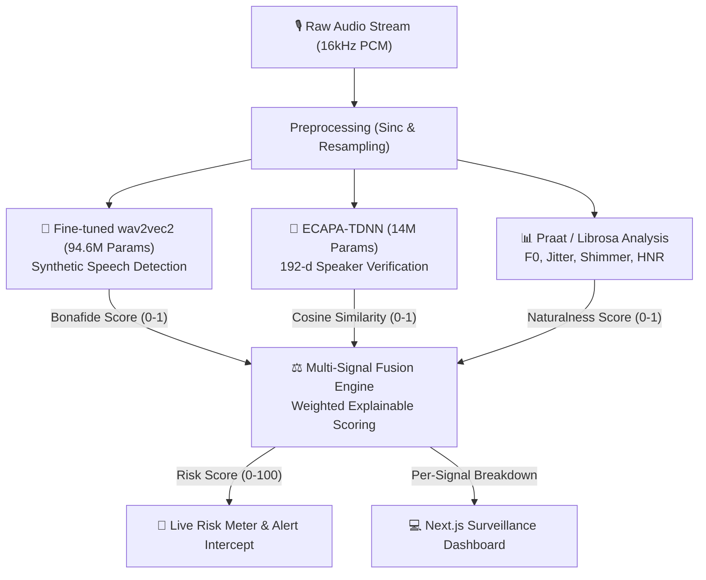

# AI-Powered Real-Time Detection & Prevention of Voice-Cloning Impersonation Attacks

[](https://www.python.org/)
[](https://pytorch.org/)
[](https://fastapi.tiangolo.com/)
[](https://nextjs.org/)
[](LICENSE)

> A real-time, explainable multimodal voice defense system that fuses **synthetic speech detection (AASIST-L)**, **speaker verification (ECAPA-TDNN)**, and **clinical prosody heuristics** into a live 0–100 risk score with continuous WebSocket surveillance.

---

## 🎯 What This Project Proves

This portfolio project proves:
> **I can take a state-of-the-art synthetic-speech detection model, a speaker-verification model, fuse their outputs into an explainable live risk score, and ship it as a working real-time system with an asynchronous WebSocket pipeline and a clean UI.**

Enterprise concerns (telecom SIP trunking, multi-regional Indian dialects, SMS alerting infra, banking SDKs) are documented in [`docs/ROADMAP.md`](docs/ROADMAP.md) as deliberate scoping decisions to focus on technical depth and low-latency ML core performance.

---

## 📐 System Architecture



---

## 🔬 Core Components

| Component | Model / Engine | Purpose | Output |
|---|---|---|---|
| **Spoof Detection** | **Fine-tuned wav2vec2** (94.6M params) | Encoder fine-tuned on 19 TTS systems; catches unseen generators | Bonafide score $\in [0, 1]$ |
| **Speaker Verification** | **ECAPA-TDNN** (SpeechBrain) | 192-d speaker embedding cosine similarity against enrolled profile | Similarity $\in [0, 1]$ |
| **Prosody Forensics** | **Parselmouth / Praat** | Extracts F0 pitch variability, micro-jitter, shimmer, and HNR | Naturalness $\in [0, 1]$ |
| **Fusion Scorer** | **Linear Multi-Signal** | Explainable weighted risk formulation (customizable via API) | Risk score $\in [0, 100]$ |
| **Streaming Gateway** | **FastAPI WebSocket** | 3.0s rolling audio ring buffer with sub-50ms CPU inference | JSON Risk Stream |

### 🧮 Explainable Fusion Formulation

Unlike monolithic black-box deepfake classifiers, the fused risk score is explicitly transparent:

$$\text{Risk} = \Big( w_{\text{spoof}} \cdot (1 - S_{\text{bonafide}}) + w_{\text{speaker}} \cdot (1 - S_{\text{speaker}}) + w_{\text{prosody}} \cdot (1 - S_{\text{naturalness}}) \Big) \times 100$$

- **Default weights**: $w_{\text{spoof}} = 0.50$, $w_{\text{speaker}} = 0.30$, $w_{\text{prosody}} = 0.20$
- **Alert threshold**: $\ge 65.0$ points triggers immediate security intercept.

---

## 📊 Measured Results

Measured on **this build**. Every figure below is reproducible with the scripts in
`scripts/`; none are quoted from papers.

The spoof model is a **fine-tuned wav2vec2 encoder** (`scripts/finetune_encoder.py`),
trained on 19 TTS systems from MLAAD plus genuine speech from LibriSpeech and a
second consumer-recording corpus. Five generators were **held out entirely** so the
evaluation measures generalisation to synthesis the model has never encountered.

### Held-out generators — never trained on

| Source | Kind | Correct | n |
|---|---|---|---|
| Edge-TTS | synthetic | **100.0%** | 161 |
| jay15k (second corpus) | synthetic | 99.5% | 200 |
| **ElevenLabs-Turbo-v2.5** | synthetic | **93.1%** | 159 |
| **ElevenLabs-v2-Multilingual** | synthetic | **91.7%** | 156 |
| ChatTTS | synthetic | 87.4% | 174 |
| **ElevenLabs-v3** | synthetic | **87.2%** | 148 |
| jay15k (second corpus) | genuine | 98.2% | 400 |
| LibriSpeech (unseen speakers) | genuine | 75.1% | 370 |

**mean genuine 86.7% · mean synthetic 93.1%**

Cross-corpus checks: `control_real` (IEMOCAP / CommonVoice / CommonLanguage) 100%,
SAPI TTS renders 100%, UniData voice conversions 73.3% caught with originals at 85%.

### Why fine-tuning, not a classifier head

| Spoof model | Unseen ElevenLabs | Genuine | Voice conversion |
|---|---|---|---|
| Pretrained wav2vec2 classifier | **0%** | 83.5% | 22% |
| Head on frozen features | 69–72% | 55–61% | 0% |
| **Fine-tuned encoder (current)** | **87–93%** | **86.7%** | **73.3%** |

Heads on frozen features plateaued at ~70% on ElevenLabs only by dropping genuine
accuracy to near chance — the representation came from a model fine-tuned for a
different task and did not separate modern cloning. Training the encoder itself
improved both classes at once.

### Honest limits

- **LibriSpeech genuine sits at 75.1%**, the weakest number here, despite being the
  one genuine corpus present in training (held-out speakers). Clean audiobook
  narration is handled worse than noisier consumer recordings, and that is not yet
  explained.
- **The generalisation claim has a boundary.** MLAAD's ElevenLabs clips share
  MLAAD's recording pipeline with the training generators, so some of that transfer
  may be corpus-level rather than purely generator-level. An independently produced
  clone is the sterner test.
- Noise reduction applied before analysis still breaks detection — see
  `scripts/denoise_effect.py`. Feed the detector the rawest audio available.
- Inference runs at **13 ms per 4-second window** on an RTX 4060; the device is
  auto-detected, falling back to CPU (~190 ms).

Licence note: MLAAD is CC BY-NC-4.0, so weights derived from it are non-commercial.

## 🚀 Quick Start

### 0. Fetch the pretrained spoof detector (required)

```bash
# Caches the wav2vec2 spoof model and fetches checkpoints/AASIST-L.pth
python scripts/download_checkpoints.py
```

Without this checkpoint the detector runs on randomly initialised weights: the
app still works end to end, but spoof scores are meaningless. That state is
reported as `spoof_detector.calibrated = false` by `GET /health` and shown as a
warning banner in the UI.

### 1. 1-Click Launch (Backend + Next.js UI)

```bash
# Launch both backend (port 8000) and frontend (port 3000) concurrently
python scripts/start_demo.py
```

### 2. Standalone CLI Pipeline Demo

```bash
# Generate sample audio fixtures (bonafide human vs. synthetic clone)
python scripts/generate_sample_audio.py

# Run end-to-end multi-signal forensic verification locally
python scripts/test_pipeline.py
```

### 3. Manual Server Setup

```bash
# Terminal 1: Start FastAPI server (REST + WebSocket on port 8000)
.venv\Scripts\activate
uvicorn backend.api.main:app --reload --port 8000

# Terminal 2: Start Next.js Surveillance Dashboard (port 3000)
cd frontend
npm run dev
```

Open [http://localhost:3000](http://localhost:3000) in your browser.

---

## 📡 API Reference

| Method | Route | Description |
|---|---|---|
| `GET` | `/health` | Health status of models, active device, enrollment state, and spoof-detector calibration |
| `POST` | `/analyze` | Upload WAV/FLAC file for multi-signal forensic scan |
| `POST` | `/enroll` | Upload reference voice or mic sample (generates 192-d embedding) |
| `DELETE` | `/enroll` | Clear active enrolled speaker profile |
| `GET` | `/config` | Retrieve current alert thresholds and fusion weights |
| `PUT` | `/config` | Dynamically update thresholds and signal weights at runtime |
| `WS` | `/ws/analyze` | Real-time binary PCM streaming endpoint (16kHz, mono) |

---

## 🔒 Privacy & On-Device Processing

- **100% On-Device Inference**: Models run locally without external cloud API calls.
- **Zero Audio Retention**: Audio chunks are analyzed in volatile memory ring buffers and immediately discarded.
- **Privacy-Preserving Speaker Verification**: Only mathematical vector embeddings (192 floats) are retained during enrollment.

---

## 📚 Project Structure

```
voice-clone-detector/
├── backend/
│   ├── models/          # wav2vec2 spoof detector (+ AASIST-L) & ECAPA-TDNN verifier
│   ├── features/        # Parselmouth / librosa prosody & acoustic extractor
│   ├── fusion/          # Explainable multi-signal risk scorer
│   ├── api/             # FastAPI REST routes and WebSocket streaming handler
│   ├── data/            # ASVspoof 2019 dataset loader & protocol parser
│   └── config.py        # Centralized Pydantic v2 configuration
├── frontend/            # Next.js 16 React client (Listen / Settings / About)
│   ├── src/components/  # LiveDetector, SettingsView, AboutView, RiskMeter, …
│   ├── src/hooks/       # useDetector — health, WebSocket stream, enrolment
│   ├── src/lib/         # WAV recorder & verdict mapping
│   └── src/app/         # App shell, navigation & styles
├── notebooks/           # Training (01) & Evaluation (02) Jupyter notebooks
├── docs/                # ARCHITECTURE.md & ROADMAP.md
├── tests/               # 42 automated pytest unit & integration tests
├── pyproject.toml       # Python packaging configuration
└── README.md
```

## 📄 License

MIT License.
